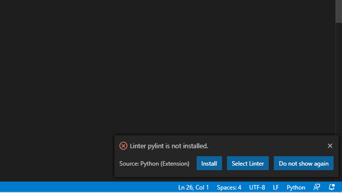

# The Visual Studio Code Python Extension
________________________________________________________________________________
<!-- @import "[TOC]" {cmd="toc" depthFrom=2 depthTo=6 orderedList=false} -->
________________________________________________________________________________

To help with Python programming, you should install the Python extension from
Microsoft.

First, open Visual Studio Code, if you don't have that open, already. Then,
create a new file anywhere named **setup.py**. You will only use this to set up
the Python environment. With the **setup.py** file open, you should get a pop-up
to install the Python environment. You can click the _Install_ button or search
for the [Python
extension](https://marketplace.visualstudio.com/items?itemName=ms-python.python)
in the extensions menu.

Keep the **setup.py** file open.

After you install that, Visual Studio Code is going to nag you every single time
you open a Python file to install a _linter_ for Python. A _linter_ is a special
program that scans your source code and tells you everything you have wrong with
it, like bad variable names, dumb spacing, potential bugs, and (usually) helpful
hints on how to fix all of it.

Feel free to do whatever you'd like, here. However, App Academy recommends
installing the default linter by clicking on the _Install_ button. Then, as you
type more and more Python, you can come to learn what _good_ Python looks like.

If you do want to install it, App Academy recommends that you install _two_ of
them.

If Visual Studio Code does not nag you to install a linter, then follow these
steps to install the default linter:

* Open your command pallette (Control+Shift+P on Windows, Command+Shift+P on
  macOS)
* Type "Select Linter" in the search box and choose "Python: Select Linter" from
  the dropdown
* In the next dropdown, select "pylint"
* Click the _Install_ button when it asks you if you want to install it

Then, follow these steps to install the PEP-8 linter to make sure your code
follows best practice guidelines:

* Open your command pallette (Control+Shift+P on Windows, Command+Shift+P on
  macOS)
* Type "Select Linter" in the search box and choose "Python: Select Linter" from
  the dropdown
* In the next dropdown, select "pycodestyle"
* Click the _Install_ button when it asks you if you want to install it

You can now open the _Problems Pane_ to see any problems that the linters find
in your Python code. In the following screenshot, you can see that
**pycodestyle** (PEP 8) is warning of a line that's too long, that it has 87
characters in it and PEP 8 says that it should be 79 characters wide. This kind
of suggestion helps everybody's code look the same.

You can now delete the **setup.py** file.
