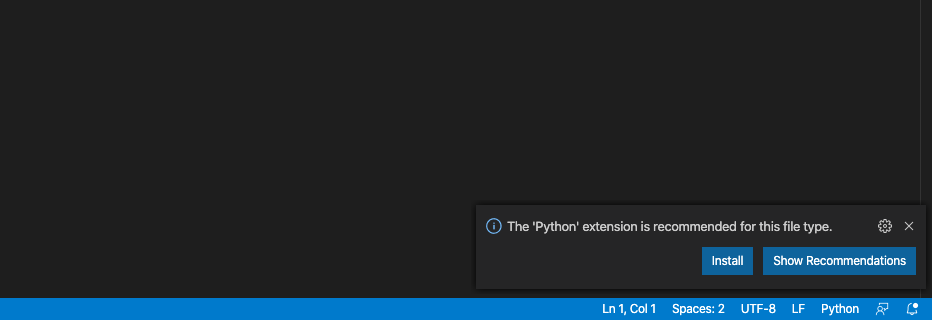
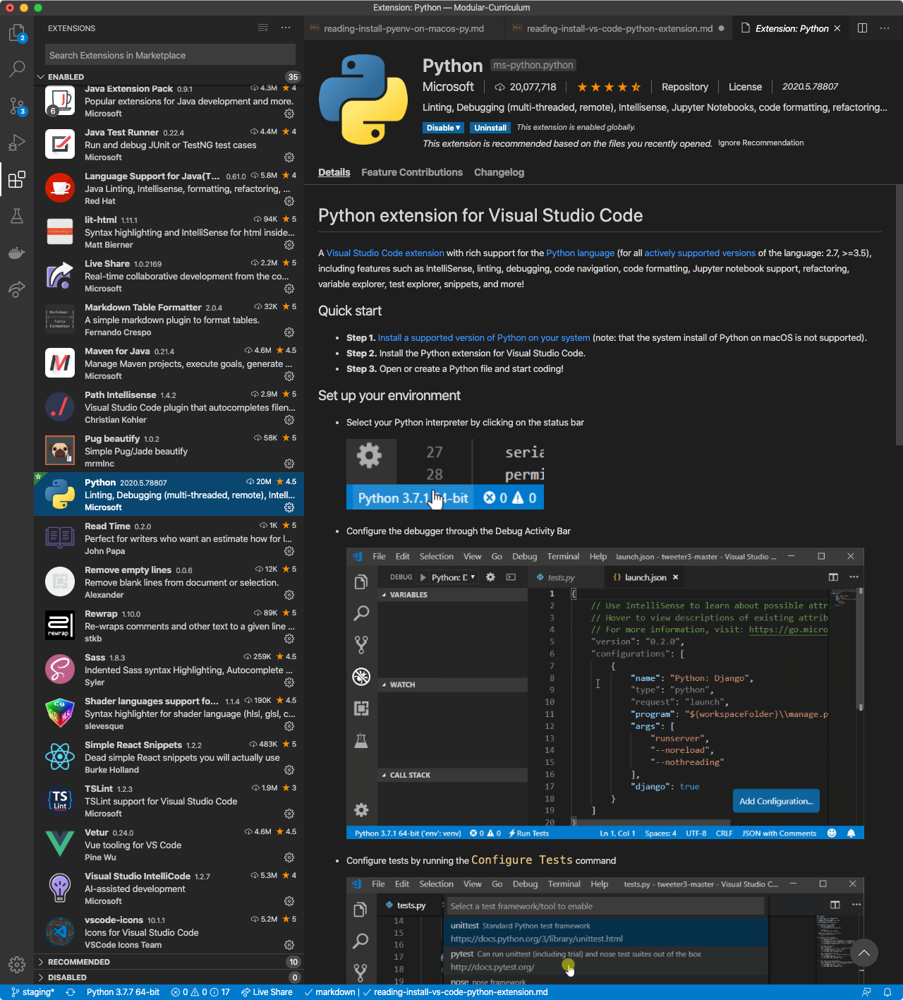
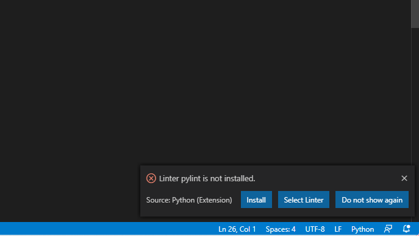
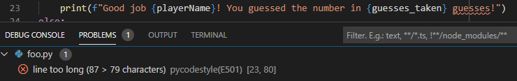

# WEEK-17 DAY-2<br>*Expressions* {ignore=true}
________________________________________________________________________________
<!-- @import "[TOC]" {cmd="toc" depthFrom=1 depthTo=2 orderedList=false} -->
________________________________________________________________________________
________________________________________________________________________________
# Installing Pyenv On WSL

The **pyenv** tool is one of the tools that lets you install different versions
of Python on your local machine and use the different ones on the command line.

It is basically **nvm**, but for Python.

First, install the prerequisites you'll need to build different Python packages.
When prompted, tell Apt that, yes, you really do want to install those packages.

```shell
sudo apt-get update
sudo apt-get install --no-install-recommends make build-essential libssl-dev zlib1g-dev libbz2-dev libreadline-dev libsqlite3-dev wget curl llvm libncurses5-dev xz-utils tk-dev libxml2-dev libxmlsec1-dev libffi-dev liblzma-dev
```

Once that finishes, install the **pyenv** code by cloning the GitHub repository
that hosts it. You can do that with the following command line.

```shell
$ git clone https://github.com/pyenv/pyenv.git ~/.pyenv
```

Once you have that, you need to update your **.bash_profile** file to define
the "PYENV_ROOT" environment variable, and to add the executable directory to
your path. Open your **.bash_profile**. (Note: If you have no **.bash_profile**
but you _do_ have a **.profile**, open that instead.)

```shell
code ~/.bash_profile
```

Then, in the file, add the following lines. If you cloned the repository into
a different path than **~/.pyenv**, then make sure that is the path you set for
"PYENV_ROOT".

```shell
# PYENV_ROOT used by pyenv to know where to look for its stuff
export PYENV_ROOT="$HOME/.pyenv"

# Add pyenv executable directory to PATH
export PATH="$PYENV_ROOT/bin:$PATH"

# Initialize pyenv if it exists
if command -v pyenv 1>/dev/null 2>&1
then
  eval "$(pyenv init -)"
fi
```

Close your Terminal and open a new one. You should see no errors in the Terminal
when it starts.

Now, install Python 3.8. This can take a while.

```
pyenv install 3.8.3
```

Now, set 3.8.3 as your default Python installation for **pyenv**.

```
pyenv global 3.8.3
```

Make sure that everything is now set by running `python --version`. You should
see "Python 3.8.3" get printed to your screen.

________________________________________________________________________________
# Installing Pyenv On macOS

The **pyenv** tool is one of the tools that lets you install different versions
of Python on your local machine and use the different ones on the command line.

It is basically **nvm**, but for Python.

Luckily, there's a Homebrew recipe for you.

```shell
brew install pyenv
```

Now, figure out what shell you're using. Open a Terminal and type `echo $SHELL`.
Find the section below that matches the output of that command.

## /bin/zsh

You need to update your **.zshrc** file to define the "PYENV_ROOT" environment
variable, and to add the executable directory to your path. Open your
**.zshrc**.

```shell
code ~/.zshrc
```

Then, in the file, add the following lines.

```shell
# Add pyenv executable directory to PATH
export PATH="$PYENV_ROOT/bin:$PATH"

# Initialize pyenv if it exists
if command -v pyenv 1>/dev/null 2>&1
then
  eval "$(pyenv init -)"
fi
```

## /bin/bash

You need to update your profile to define the "PYENV_ROOT" environment variable,
and to add the executable directory to your path.

Type `ls ~/.bash_profile`. Either you will see a file listed there _or_ you
will get an error message that reads "No such file or directory". If you get the
error message, type `ls ~/.profile`. You _should_ see a file name listed.

If you saw **/Users/your-user/.bash_profile**, then type this:

```shell
code ~/.bash_profile
```

If you saw **/Users/your-user/.profile**, then type this:

```shell
code ~/.profile
```

Then, in the file, add the following lines.

```shell
# Add pyenv executable directory to PATH
export PATH="$PYENV_ROOT/bin:$PATH"

# Initialize pyenv if it exists
if command -v pyenv 1>/dev/null 2>&1
then
  eval "$(pyenv init -)"
fi
```

## Everyone, altogether!

Close your Terminal and open a new one.

Now, install Python 3.8.3 as your default Python installation for **pyenv**.
This can take a while.

```
pyenv install 3.8.3
```

Now, set 3.8.3 as your default Python installation for **pyenv**.

```
pyenv global 3.8.3
```

Make sure that everything is now set by running `python --version`. You should
see "Python 3.8.3" get printed to your screen.

________________________________________________________________________________
# The Visual Studio Code Python Extension

To help with Python programming, you should install the Python extension from
Microsoft.

First, open Visual Studio Code, if you don't have that open, already. Then,
create a new file anywhere named **setup.py**. You will only use this to set up
the Python environment. With the **setup.py** file open, you should get a pop-up
to install the Python environment. You can click the _Install_ button or search
for the [Python
extension](https://marketplace.visualstudio.com/items?itemName=ms-python.python)
in the extensions menu.





Keep the **setup.py** file open.

After you install that, Visual Studio Code is going to nag you every single time
you open a Python file to install a _linter_ for Python. A _linter_ is a special
program that scans your source code and tells you everything you have wrong with
it, like bad variable names, dumb spacing, potential bugs, and (usually) helpful
hints on how to fix all of it.



Feel free to do whatever you'd like, here. However, App Academy recommends
installing the default linter by clicking on the _Install_ button. Then, as you
type more and more Python, you can come to learn what _good_ Python looks like.

If you do want to install it, App Academy recommends that you install _two_ of
them.

If Visual Studio Code does not nag you to install a linter, then follow these
steps to install the default linter:

* Open your command pallette (Control+Shift+P on Windows, Command+Shift+P on
  macOS)
* Type "Select Linter" in the search box and choose "Python: Select Linter" from
  the dropdown
* In the next dropdown, select "pylint"
* Click the _Install_ button when it asks you if you want to install it

Then, follow these steps to install the PEP-8 linter to make sure your code
follows best practice guidelines:

* Open your command pallette (Control+Shift+P on Windows, Command+Shift+P on
  macOS)
* Type "Select Linter" in the search box and choose "Python: Select Linter" from
  the dropdown
* In the next dropdown, select "pycodestyle"
* Click the _Install_ button when it asks you if you want to install it

You can now open the _Problems Pane_ to see any problems that the linters find
in your Python code. In the following screenshot, you can see that
**pycodestyle** (PEP 8) is warning of a line that's too long, that it has 87
characters in it and PEP 8 says that it should be 79 characters wide. This kind
of suggestion helps everybody's code look the same.



You can now delete the **setup.py** file.

________________________________________________________________________________
# Back to the Beginning: Hello World

In the next few sections, you'll be learning the fundamentals of the Python
programming language. You will find you can use many of the principles (and even
some of code) that you learned in JavaScript to help you progress more quickly.

When you finish this article, you should be able to
- Use PEP 8 as a reference for how to write your code
- `print` messages to the console terminal
- Use `#` and `"""` to write code comments

## The style guide for Python

Unlike JavaScript, where everybody can have their own "style" of writing it
(with parentheses, without parentheses, long lines, lots of line breaks), the
Python community has spent a lot of time creating and curating a style guide so
that everyone in the Python community can code in ways that look like each
other's code. The guide is known as [PEP 8][1] and one of its main authors is
the creator of Python, Guido van Rossum.

A "PEP" is a "Python Enhancement Proposals", kind of like an RFC specifically
for Python. There's an entire index of PEPs at the [Index of Python Enhancement
Proposals][4].

## Visual feedback in your programs

In JavaScript, you became very familiar with `console.log`. But did you ever
wonder why it wasn't just "print to the screen"?

The term **print** comes from other languages, like Python, which were developed
for use primarily in a terminal window or running as a server. **Print**
commands cause messages to show in the terminal. You can also use it to write
content to files! Terminals are generally interactive. You can open one up, type
commands in it, and get responses back from the programs that you run, like
`git clone` or `npx create-react-app`.

On the other hand, JavaScript was first developed as a front-end language where
it was running in browsers instead of terminals. The original browser with
JavaScript, Netscape, offered a read-only **console** for reading messages put
there for debugging purposes. There was _no_ interactivity in that early
consoles (and aren't in many things still called "consoles"). Traditionally,
writing to a console is called **logging**. You're just creating a message in
the overall log (like a diary or "Captain's Log" if you know Star Trek). Hence
the birth of `console.log`. The development team creating Node.js kept
JavaScript's `console.log` for consistency.

All this history is simply to help you remember that the `print` function in
Python has the same effect as `console.log` in JavaScript. Therefore, it is a
way you can see output from your programs.

Imagine this is your first program:

```python
print("hello world")
```

Executing this program would print out the following

```
hello world
```

### About semicolons

Nothing too groundbreaking here, but notice how there are no semicolons at then
end of lines in Python. If you include them you probably won't break anything.
However, your coding tool may show warnings, unit tests that include syntax
checking will fail, and your developer buddies may tease you for not being a
"real" Python developer.

## Code comments

Single-line or inline comments in Python use the hash symbol "#", also known as
**hashtag**, **pound sign**, **number symbol**, **octothorpe**, or simply
**hatch**.

> Fun fact: It is possible to guess the prior experience of a developer by term
> they use for the comment character in Python.

Most comments appear on a single line before the code they describe

```python
# Here's my question for the day
print("What is the meaning of life?")
```

Sometimes it is useful to include a short comment at the end of a line

```python
wait_time = 60000 # milliseconds
```

## Built-in documentation

Python has a built-in way to document functions so you don't have to look at the
code's source files to see the description of it!

Extensive comments for documentation purposes, such as description of a class or
function can be spread across multiple lines using three quotes. That means the
comment both begins and ends with a triple quote (`"""`).

For example, here's a function with some documentation.

```python
def foo():
    """
    The foo function does many amazing things that you
    should not question. Just accept that it exists and
    use it with caution.
    """
    secretThing()
```

When you define that function, you can use the built-in `help` function to get
the function's definition back!

```
>>> help(foo)
Help on function foo in module __main__:

foo()
    The foo function does many amazing things that you
    should not question. Just accept that it exists and
    use it with caution.
```

This means that documentation for built-in functions and libraries are _always_
available to you, even if you don't have access to the big PDF, online, or an
offline documentation viewer.

## Optional reading

- Interesting article on [Octothorpe]
- Best practices for [Commenting Python Code]

## What you've learned

- `print` messages to the console terminal
- Use `#` to write code comments
- Use `"""` to document things


[1]: https://www.python.org/dev/peps/pep-0008/
[Octothorpe]: https://time.com/2870942/hashtag-oed-oxford-english-dictionary/
[Commenting Python Code]: https://www.digitalocean.com/community/tutorials/how-to-write-comments-in-python-3
[4]: https://www.python.org/dev/peps/

________________________________________________________________________________
# Number Data Types

There are several types of numbers in Python. They are the foundation for
mathematics and calculations.

The arithmetic expressions, order of operations and grouping operators you
learned in JavaScript are all applicable in Python.

Python adds a few key features to make arithmetic faster and more powerful.

When you finish this article, you should be able to:

- Explain the most common types of numbers in Python
- Evaluate arithmetic expressions that include familiar operators and `**`, `//`
  and `%`
- Predict when an arithmetic expression will throw an error

## Types of numbers

In JavaScript there was just one numeric type, `Number`. However, Python
distinguishes between three numeric types.

### Integer

Counting numbers, both positive and negative, are called _integers_. They have
no decimal point.

Unlike JavaScript, integers are a different type of number than decimals, they
are fundamentally a different kind of in-memory representation.

Integers are created by a literal number with no decimal point or through
the use of the `int()` constructor.

```python
print(3)         # => 3
print(int(19))   # => 19
print(int())     # => 0
```

> Interesting fact: Boolean is a subtype of integer in Python.

### Floating point number

The decimal numbers in Python are called _floating point numbers_. The precision
(number of decimal places) and internal representation (how they are stored)
can change slightly depending on the machine on which your program is running.
Very rarely does this have any effect unless you are doing extremely precise
work (as in certain scientific fields).

"Floating point number"... that's a weird term. That's because the decimal point
"floats" based on how many digits come before the decimal point, it floats
around the number, sometimes at position 1 for some numbers (.123), and sometime
at position 7 for some numbers (123456.38).

While you may not have experienced it yet, floating point numbers are known to
have the occasional rounding error. Open up Node.js and try evaluating the
expression "4.1 - 3". Open up Python and try the same thing. That's because of
the way "floating point numbers" are stored in memory, they are prone to this
type of rounding error.

Floating point numbers are created using numbers with a decimal point, with the
`float()` constructor, or using scientific notation.

```python
print(2.24)      # => 2.24
print(2.)        # => 2.0
print(float())   # => 0.0
print(27e-5)     # => 0.00027
```

### Complex numbers

**Note**: You will not be assessed on complex numbers. This is here for
informational benefit, only.

Complex numbers consist of a real part and an imaginary part. In mathematics
this is often written as `5 + 7i` where 5 is the real part and 7 is the
imaginary part. In programming the `i` is often switched to a `j`. Python
follows this pattern also.

The imaginary part of a complex number can be specified by appending `j` or `J`
to a number (which makes an imaginary part with zero real part). Complex numbers
are created by adding a real part to an imaginary part or using the `complex()`
constructor. If omitted, the imaginary part defaults to zero.

```python
print(7j)              # => 7j
print(5.1+7.7j))     # => 5.1+7.7j
print(complex(3, 5))    # => 3+5j
print(complex(17))     # => 17+0j
print(complex())       # => 0j
```

> Fun fact: Both the real part and the imaginary part of a *complex number* are
> stored as floating point numbers.

While it is unlikely you will use complex numbers in the remainder of this
course, the seamless integration of complex numbers in Python is one of many
reasons a development team with math on their minds would choose to use this
language.

## Type casting

When once type of number is converted to another, the process used is called
*type casting*. It is performed using built-in functions for each type.

Example 1: Type-cast float to integer using `float`
```python
print(17)               # => 17
print(float(17))        # => 17.0
```

Example 2: Type-cast float to integer using `int`
```python
print(17.0)             # => 17.0
print(int(17.0))        # => 17
```

Example 3: Type-cast float or integer to string using `str`
```python
print(str(17.0) + ' and ' + str(17))        # => 17.0 and 17
```

The output from print sometimes looks the same for strings and numbers. However,
without type casting you would receive an error when trying to do this
concatenation with the string ` and `.

For example
```python
print(17.0 + ' and ' + 17)
```
results in
```plaintext
TypeError: unsupported operand type(s) for +: 'float' and 'str'
```

## Arithmetic operators

These operators are the same in JavaScript and Python

- `+` (addition)
- `-` (subtraction)
- `*` (multiplication)
- `/` (division)
- `%` (modulo)

Python includes two other useful operators for common arithmetic expressions

- `**` (exponent)
- `//` (integer division)

One of the interesting idiomatic quirks of reading Python is that a lot of code
does _not_ put spaces around arithmetic operators and their operators. You will
often see code in Python like this

```python
print(num+1)
```

whereas in JavaScript, the style is

```javascript
print(num + 1)
```

This really only applies to arithmetic operators.

### Exponentiation

Multiplying a number, `a`, by itself a certain number of times, `b`, is written
in Python as `a**b`. In mathematics, this is known as *exponentiation*.
Sometimes, you will hear this expression referred to as "a to the power of b"
or "a to the b power".

Some examples include
```python
print(2**3)        # => 8
print(5.5**15)     # => 127479497357.65536
print(10**30)      # => 1000000000000000000000000000000
print(10.0**30)    # => 1e+30
```

Notice that when integer numbers get large, they stay integer numbers. However,
a floating point number switches to scientific notation.

Even very large integers are not a problem for Python. The
[official documentation] says "Integers have unlimited precision."

For example, the output of `print(10**100)` is

```plaintext
1000000000000000000000000000000000000000000000000000000000000000000000000000
0000000000000000000000000000000000000000000000000000000000000000000000000000
0000000000000000000000000000000000000000000000000000000000000000000000000000
0000000000000000000000000000000000000000000000000000000000000000000000000000
0000000000000000000000000000000000000000000000000000000000000000000000000000
0000000000000000000000000000000000000000000000000000000000000000000000000000
0000000000000000000000000000000000000000000000000000000000000000000000000000
0000000000000000000000000000000000000000000000000000000000000000000000000000
0000000000000000000000000000000000000000000000000000000000000000000000000000
0000000000000000000000000000000000000000000000000000000000000000000000000000
0000000000000000000000000000000000000000000000000000000000000000000000000000
0000000000000000000000000000000000000000000000000000000000000000000000000000
0000000000000000000000000000000000000000000000000000000000000000000000000000
0000000000000
```

On the other hand, floating point numbers eventually run out of memory and
throw an error. For example, just by adding a `.0`, you'll find
`print(10.0**100)` outputs `OverflowError: (34, 'Result too large')`.

#### Naming large numbers

Speaking of really large numbers...

Here's a bit of trivia you might find interesting to share at the next dinner
party you attend with your developer buddies. You will not be quizzed on this.
It's just a fun and short read for those who are interested.

Origin of [googol and googolplex]

### Integer division with remainders

Remember *modulo* (`%`) gives the remainder that results from a division.

The `//` operator gives the other part of that division. This is the equivalent
to the floor of the answer.

For example

```python
print(47 // 8)         # => 5
print(47 % 8)          # => 7
```

Means that in long division 47 divided by 8 is 5 with remainder 7.

In programming terms, the `//` operator provides a quick way to divide numbers
and round down.

When floating point numbers are used with integer division or modulo, the
result will also be a floating point number

```python
print(47.0 // 8.0)     # => 5.0
print(47.0 % 8.0)      # => 7.0
```

Complex numbers cannot be used with integer division or modulo; rather, they
throw errors.

```python
print(complex(47) // 8)     # => TypeError: can't take floor of complex number.
print(complex(47) % 8)      # => TypeError: can't mod complex numbers.
```

## Assignment shorthand

Like Javascript, Python supports shorthand operators for modifying a variable's
value. As you probably guessed, all arithmetic operators have corresponding
shorthand equivalents.

- `+=` (addition)
- `-=` (subtraction)
- `*=` (multiplication)
- `/=` (division)
- `%=` (modulo)
- `**=` (exponentiation)
- `//=` (integer division)

> Notice: The ++ and -- operators don't exist in Python because they wouldn't
> be operators. Instead, Python uses += and -= only. This was a design decision
> by the Python team for simplicity and consistency.

## What you've learned

- Explain the most common types of numbers in Python
- Evaluate arithmetic expressions including `**`, `//` and `%`
- Predict when an arithmetic expression will throw an error


[official documentation]: https://docs.python.org/3/library/stdtypes.html#numeric-types-int-float-complex
[googol and googolplex]: https://whatis.techtarget.com/definition/googol-and-googolplex

________________________________________________________________________________
# Number Data Types

There are several types of numbers in Python. They are the foundation for
mathematics and calculations.

The arithmetic expressions, order of operations and grouping operators you
learned in JavaScript are all applicable in Python.

Python adds a few key features to make arithmetic faster and more powerful.

When you finish this article, you should be able to:

- Explain the most common types of numbers in Python
- Evaluate arithmetic expressions that include familiar operators and `**`, `//`
  and `%`
- Predict when an arithmetic expression will throw an error

## Types of numbers

In JavaScript there was just one numeric type, `Number`. However, Python
distinguishes between three numeric types.

### Integer

Counting numbers, both positive and negative, are called _integers_. They have
no decimal point.

Unlike JavaScript, integers are a different type of number than decimals, they
are fundamentally a different kind of in-memory representation.

Integers are created by a literal number with no decimal point or through
the use of the `int()` constructor.

```python
print(3)         # => 3
print(int(19))   # => 19
print(int())     # => 0
```

> Interesting fact: Boolean is a subtype of integer in Python.

### Floating point number

The decimal numbers in Python are called _floating point numbers_. The precision
(number of decimal places) and internal representation (how they are stored)
can change slightly depending on the machine on which your program is running.
Very rarely does this have any effect unless you are doing extremely precise
work (as in certain scientific fields).

"Floating point number"... that's a weird term. That's because the decimal point
"floats" based on how many digits come before the decimal point, it floats
around the number, sometimes at position 1 for some numbers (.123), and sometime
at position 7 for some numbers (123456.38).

While you may not have experienced it yet, floating point numbers are known to
have the occasional rounding error. Open up Node.js and try evaluating the
expression "4.1 - 3". Open up Python and try the same thing. That's because of
the way "floating point numbers" are stored in memory, they are prone to this
type of rounding error.

Floating point numbers are created using numbers with a decimal point, with the
`float()` constructor, or using scientific notation.

```python
print(2.24)      # => 2.24
print(2.)        # => 2.0
print(float())   # => 0.0
print(27e-5)     # => 0.00027
```

### Complex numbers

**Note**: You will not be assessed on complex numbers. This is here for
informational benefit, only.

Complex numbers consist of a real part and an imaginary part. In mathematics
this is often written as `5 + 7i` where 5 is the real part and 7 is the
imaginary part. In programming the `i` is often switched to a `j`. Python
follows this pattern also.

The imaginary part of a complex number can be specified by appending `j` or `J`
to a number (which makes an imaginary part with zero real part). Complex numbers
are created by adding a real part to an imaginary part or using the `complex()`
constructor. If omitted, the imaginary part defaults to zero.

```python
print(7j)              # => 7j
print(5.1+7.7j))     # => 5.1+7.7j
print(complex(3, 5))    # => 3+5j
print(complex(17))     # => 17+0j
print(complex())       # => 0j
```

> Fun fact: Both the real part and the imaginary part of a *complex number* are
> stored as floating point numbers.

While it is unlikely you will use complex numbers in the remainder of this
course, the seamless integration of complex numbers in Python is one of many
reasons a development team with math on their minds would choose to use this
language.

## Type casting

When once type of number is converted to another, the process used is called
*type casting*. It is performed using built-in functions for each type.

Example 1: Type-cast float to integer using `float`
```python
print(17)               # => 17
print(float(17))        # => 17.0
```

Example 2: Type-cast float to integer using `int`
```python
print(17.0)             # => 17.0
print(int(17.0))        # => 17
```

Example 3: Type-cast float or integer to string using `str`
```python
print(str(17.0) + ' and ' + str(17))        # => 17.0 and 17
```

The output from print sometimes looks the same for strings and numbers. However,
without type casting you would receive an error when trying to do this
concatenation with the string ` and `.

For example
```python
print(17.0 + ' and ' + 17)
```
results in
```plaintext
TypeError: unsupported operand type(s) for +: 'float' and 'str'
```

## Arithmetic operators

These operators are the same in JavaScript and Python

- `+` (addition)
- `-` (subtraction)
- `*` (multiplication)
- `/` (division)
- `%` (modulo)

Python includes two other useful operators for common arithmetic expressions

- `**` (exponent)
- `//` (integer division)

One of the interesting idiomatic quirks of reading Python is that a lot of code
does _not_ put spaces around arithmetic operators and their operators. You will
often see code in Python like this

```python
print(num+1)
```

whereas in JavaScript, the style is

```javascript
print(num + 1)
```

This really only applies to arithmetic operators.

### Exponentiation

Multiplying a number, `a`, by itself a certain number of times, `b`, is written
in Python as `a**b`. In mathematics, this is known as *exponentiation*.
Sometimes, you will hear this expression referred to as "a to the power of b"
or "a to the b power".

Some examples include
```python
print(2**3)        # => 8
print(5.5**15)     # => 127479497357.65536
print(10**30)      # => 1000000000000000000000000000000
print(10.0**30)    # => 1e+30
```

Notice that when integer numbers get large, they stay integer numbers. However,
a floating point number switches to scientific notation.

Even very large integers are not a problem for Python. The
[official documentation] says "Integers have unlimited precision."

For example, the output of `print(10**100)` is

```plaintext
1000000000000000000000000000000000000000000000000000000000000000000000000000
0000000000000000000000000000000000000000000000000000000000000000000000000000
0000000000000000000000000000000000000000000000000000000000000000000000000000
0000000000000000000000000000000000000000000000000000000000000000000000000000
0000000000000000000000000000000000000000000000000000000000000000000000000000
0000000000000000000000000000000000000000000000000000000000000000000000000000
0000000000000000000000000000000000000000000000000000000000000000000000000000
0000000000000000000000000000000000000000000000000000000000000000000000000000
0000000000000000000000000000000000000000000000000000000000000000000000000000
0000000000000000000000000000000000000000000000000000000000000000000000000000
0000000000000000000000000000000000000000000000000000000000000000000000000000
0000000000000000000000000000000000000000000000000000000000000000000000000000
0000000000000000000000000000000000000000000000000000000000000000000000000000
0000000000000
```

On the other hand, floating point numbers eventually run out of memory and
throw an error. For example, just by adding a `.0`, you'll find
`print(10.0**100)` outputs `OverflowError: (34, 'Result too large')`.

#### Naming large numbers

Speaking of really large numbers...

Here's a bit of trivia you might find interesting to share at the next dinner
party you attend with your developer buddies. You will not be quizzed on this.
It's just a fun and short read for those who are interested.

Origin of [googol and googolplex]

### Integer division with remainders

Remember *modulo* (`%`) gives the remainder that results from a division.

The `//` operator gives the other part of that division. This is the equivalent
to the floor of the answer.

For example

```python
print(47 // 8)         # => 5
print(47 % 8)          # => 7
```

Means that in long division 47 divided by 8 is 5 with remainder 7.

In programming terms, the `//` operator provides a quick way to divide numbers
and round down.

When floating point numbers are used with integer division or modulo, the
result will also be a floating point number

```python
print(47.0 // 8.0)     # => 5.0
print(47.0 % 8.0)      # => 7.0
```

Complex numbers cannot be used with integer division or modulo; rather, they
throw errors.

```python
print(complex(47) // 8)     # => TypeError: can't take floor of complex number.
print(complex(47) % 8)      # => TypeError: can't mod complex numbers.
```

## Assignment shorthand

Like Javascript, Python supports shorthand operators for modifying a variable's
value. As you probably guessed, all arithmetic operators have corresponding
shorthand equivalents.

- `+=` (addition)
- `-=` (subtraction)
- `*=` (multiplication)
- `/=` (division)
- `%=` (modulo)
- `**=` (exponentiation)
- `//=` (integer division)

> Notice: The ++ and -- operators don't exist in Python because they wouldn't
> be operators. Instead, Python uses += and -= only. This was a design decision
> by the Python team for simplicity and consistency.

## What you've learned

- Explain the most common types of numbers in Python
- Evaluate arithmetic expressions including `**`, `//` and `%`
- Predict when an arithmetic expression will throw an error


[official documentation]: https://docs.python.org/3/library/stdtypes.html#numeric-types-int-float-complex
[googol and googolplex]: https://whatis.techtarget.com/definition/googol-and-googolplex

________________________________________________________________________________
# The String Data Type

Strings in Python are very similar to strings in JavaScript.

When you finish this article, you should be able to:
- Write strings using the correct syntax
- Use `len()` to obtain a count of the number of characters in a string
- Refer to one or more characters in a string
- Concatenate strings together

## Writing a valid string

Strings are wrapped with single quotation marks (`'`) or double quotation marks
(`"`). In between you can put any characters except that same quotation mark
or line break (ENTER key).

Valid strings
```python
"This is cool!"
'a1b2c3'
```

Invalid string
```python
"Tom shouted, "Go outside!""
```

To use a double quote as a character of a string, simply
enclose the string in single quotes, and vice versa.

### Escaping characters

Sometimes you need both single and double quotes within a string. In that case
you can indicate that a quote is not the end of a string by using a backslash
(\\) immediately before it.
```python
'Jodi asked, "What\'s up, Sam?"'
```

### Multiline strings

Python allows strings to span multiple lines using what's called
**triple quotes** (`'''`). That is three apostrophes (or single quotation marks)
in a row to start the string and another three to end the string.

For example
```python
print('''My instructions are very long so to make them
more readable in the code I am putting them on
more than one line. I can even include "quotes"
of any kind because they won't get confused with
the end of the string!''')
```

Produces this output
```plaintext
My instructions are very long so to make them
more readable in the code I am putting them on
more than one line. I can even include "quotes"
of any kind because they won't get confused with
the end of the string!
```

> Warning: Don't get this confused with three double quotes used for comments!

## Calculating length

A single string can contain many characters. It may be useful to know how long
a string is, so Python offers the `len()` function.

```python
print(len("Spaghetti"))    # => 9
```

## Indexing a string

Like JavaScript, Python starts counting at zero. This is called
*zero-based indexing*. A character in a string can be accessed with square
brackets.

```python
print("Spaghetti"[0])    # => S
print("Spaghetti"[4])    # => h
```

Python allows negative indexes to access a character from the end of the string.
The last character is at index -1.

```python
print("Spaghetti"[-1])    # => i
print("Spaghetti"[-4])    # => e
```

Additionally, Python gives shortcuts to get a series of characters by using
a *range*. A range consists of a start value followed by a colon then an end
value.

> Important: The series returned does not include the end value.

```python
print("Spaghetti"[1:4])  # => pag
print("Spaghetti"[4:-1])    # => hett
print("Spaghetti"[4:4])  # => (empty string)
```

A shortcut for the beginning of the string is to omit the first number.

```python
print("Spaghetti"[:4])  # => Spag
print("Spaghetti"[:-1])    # => Spaghett
```

A shortcut for the end of the string is to omit the second number.

```python
print("Spaghetti"[1:])  # => paghetti
print("Spaghetti"[-4:])    # => etti
```

If a single index is requested which is not in the string, then an error occurs.
```python
print("Spaghetti"[15])    # => IndexError: string index out of range
print("Spaghetti"[-15])    # => IndexError: string index out of range
```

However, ranges do not error.
```python
print("Spaghetti"[:15])    # => Spaghetti
print("Spaghetti"[15:])    # => (empty string)
print("Spaghetti"[-15:])    # => Spaghetti
print("Spaghetti"[:-15])    # => (empty string)
print("Spaghetti"[15:20])    # => (empty string)
```

## Using string functions

### Function: index

The `index` function in Python is similar to the `indexOf` function in
Javascript.

Calculate the first position of a character within a string using `index`.

```python
print("Spaghetti".index("h"))    # => 4
print("Spaghetti".index("t"))    # => 6
```

If the character is not found an error occurs.
(In JavaScript. a -1 was returned.)

```python
print("Spaghetti".index("s"))    # => ValueError: substring not found
```

### Function: count

Find out how many times a substring appears in the primary string using `count`.
It returns zero if the substring is not there.

```python
print("Spaghetti".count("h"))    # => 1
print("Spaghetti".count("t"))    # => 2
print("Spaghetti".count("s"))    # => 0
print('''We choose to go to the moon in this decade and do the other things,
not because they are easy, but because they are hard, because that goal will
serve to organize and measure the best of our energies and skills, because that
challenge is one that we are willing to accept, one we are unwilling to
postpone, and one which we intend to win, and the others, too.
'''.count('the '))                # => 4
```

## Concatenation

Like Javascript, Python uses the addition operator (`+`) to stitch strings
together.

```python
print("gold" + "fish")    # => goldfish
```

Unlike Javascript, Python also uses the multiplication operator (`*`) to
repeat a string a given number of times.

```python
print("s"*5)              # => sssss
```

This can be very helpful when you want to quickly create a billion dollars. ;)

```python
print("$1" + ",000"*3)     # => $1,000,000,000
```

## Formatting

When debugging in Python it can be very helpful to put together strings and
data to figure out what's going on.

One way to do this is with the `format` function. You will find this in many
examples and Q&A sites online. First, use placeholders in the string where you
want the data to go. A placeholder is a number inside braces like this `{0}`.
Start at zero and each placeholder gets the next number. The use the `format`
function on your string and pass in the data to substitute.

```python
first_name = "Billy"
last_name = "Bob"
print('Your name is {0} {1}'.format(first_name, last_name))  # => Your name is Billy Bob
```

The format function is very powerful and can do much more with strings. These
topics will be introduced as needed.

For simple uses, a fast way to apply formatting is using the 'f' flag on the
string. This means putting using single quotes with an `f` at the start.

```python
print(f'Your name is {first_name} {last_name}')
```

## Useful string methods

The following table shows some very useful string methods on the string object.

| Value               | Method               | Result                    |
|---------------------|----------------------|---------------------------|
| `s = "Hello"`       | `s.upper()`          | `"HELLO"`                 |
| `s = "Hello"`       | `s.lower()`          | `"hello"`                 |
| `s = "Hello"`       | `s.islower()`        | `False`                   |
| `s = "hello"`       | `s.islower()`        | `True`                    |
| `s = "Hello"`       | `s.isupper()`        | `False`                   |
| `s = "HELLO"`       | `s.isupper()`        | `True`                    |
| `s = "Hello"`       | `s.startswith("He")` | `True`                    |
| `s = "Hello"`       | `s.endswith("lo")`   | `True`                    |
| `s = "Hello World"` | `s.split()`          | `["Hello", "World"]`      |
| `s = "i-am-a-dog"`  | `s.split("-")`       | `["i", "am", "a", "dog"]` |

In JavaScript, the `join` method was on the `Array` object. In Python, the
`join` method is on the String object.

```python
s = "--".join(["it", "is", "kind"])
print(s)

# Prints it--is--kind
```

Python also has some handy testing methods for the contents of a string. The
following table lists some of those.

| Method        | Purpose                                                                                                                     |
|---------------|-----------------------------------------------------------------------------------------------------------------------------|
| `isalpha()`   | returns `True` if the string consists only of letters and is not blank.                                                     |
| `isalnum()`   | returns `True` if the string consists only of letters and numbers and is not blank.                                         |
| `isdecimal()` | returns `True` if the string consists only of numeric characters and is not blank.                                          |
| `isspace()`   | returns `True` if the string consists only of spaces, tabs, and newlines and is not blank.                                  |
| `istitle()`   | returns `True` if the string consists only of words that begin with an uppercase letter followed by only lowercase letters. |

## What you've learned

- Write strings using the correct syntax
- Use `len()` to obtain a count of the number of characters in a string
- Refer to one or more characters in a string
- Concatenate strings together

________________________________________________________________________________
# Variables and Expressions

*Variables* are used to label and store data in memory to be referenced and 
used in a computer program.

When you finish this article, you should be able to
- Explain **duck-typing**
- Predict when errors will be thrown when using variables and expressions
- Explain the meaning of `None` in Python

## Duck-typing

> If it looks like a duck and quacks like a duck, then it must be a duck.

**Duck typing** is a programming style which avoids checking an object's 
"type" to figure out what it can do. In other words, duck-typing avoids tests 
for `type()` or `isinstance()`.

Instead a method or attribute is simply called or used in the code. If 
necessary a check would be for `hasattr()`. This approach is also known as 
[EAFP]: **E**asier to **a**sk for **f**orgiveness than **p**ermission

By focusing on interfaces, duck-typing makes well-designed code more flexible.

Python uses *duck-typing* as its fundamental approach.

## Assigning variables

Python has no variable declaration keyword such as `let`, `var` or `const`. 
Instead, the assignment of a value automatically declares a variable.

```python
a = 7
b = 'Marbles'
print(a)         # => 7
print(b)         # => Marbles
```

Variable assignment can be chained to give several variables the same initial
value.

```python
count = max = min = 0
print(count)           # => 0
print(max)             # => 0
print(min)             # => 0
```

Often assignment chaining makes code less readable, so use it with caution.
However, many online examples will include it so now you know how to read it.

## Manipulating variables

The value - and even the type - of a variable can be reassigned at any time.

```python
a = 17
print(a)         # => 17
a = 'seventeen'
print(a)         # => seventeen
```

Python will not throw any errors. That means it is very important to name 
variables clearly so you don't accidentally reassign one causing errors or 
confusion.

The assignment shorthand operators from JavaScript also work in Python:
- `+=`
- `-=`
- `*=`
- `/=`

In fact, all the arithmetic operators have shorthand counterparts:
- `**=` (exponent)
- `//=` (integer division)
- `%=` (modulo)

## What about NaN

Unlike JavaScript, Python will not return NaN as the result of calculations;
instead, it throws exceptions.

Here's an example
```python
a = '7'
a /= 2
print(a)
```

Where the output is

```plaintext
TypeError: unsupported operand type(s) for /=: 'str' and 'int'
```

If you absolutely have to have it, you can create "not a number" by sending the 
string `"nan"` into the float constructor.

```python
print(float("nan"))
```

## None

Python's replacement for `null` is `None`. It is used to indicate a variable has 
no value.

`None` is very special because it is actually an object (of type `NoneType`). 
That means it can be used wherever other objects are used.

Assigning a variable the value `None` is as easy as it sounds.

```python
my_var = None
```

And it is just as easy to find out if the value of a variable is `None`.

```python
print(my_var is None)     # => True
```

### Why use Python's `None` type?

There are many cases when you may use `None`.

Often you will want to perform an action that may or may not work. Using `None` 
is one way you can check what happened.

For example, maybe you are loading optional instructions from a file. 
If that file in not found, the `instructions` variable's value 
could remain `None`. Then later in your code you check 
`instructions is not None` so the program knows whether to display those 
instructions or skip that step.

## What you've learned

- Explain **duck typing**
- Predict when errors will be thrown when using variables and expressions
- Explain the meaning of `None` in Python

[EAFP]: https://docs.python.org/3/glossary.html#term-eafp
________________________________________________________________________________
# The Boolean Type

The **Boolean** data type is perhaps the simplest because it has only two 
possible values, `True` and `False`.

When you finish this article, you should be able to:
- Predict the evaluation of expressions that use the boolean operations of 
`and`, `or` and `not`
- Explain how Python handles non-Boolean objects in conditional statements

## Logical operators

One of the simplicities that developers like about Python is that it reads more
like English than JavaScript - especially with the logical operators.

For reference, here's a comparison table.

| Python | JavaScript |
|:------:|:----------:|
| `and`  |    `&&`    |
|  `or`  |    `||`    |
| `not`  |    `!`     |

Here is an example of how Python reads like English.

```python
# Logical AND
print(True and True)    # => True
print(True and False)   # => False
print(False and False)  # => False

# Logical OR
print(True or True)     # => True
print(True or False)    # => True
print(False or False)   # => False

# Logical NOT
print(not True)             # => False
print(not False and True)   # => True
print(not True or False)    # => False
```

The rules of logic apply in Python as in every other language, including 
DeMorgan's Law.

- `not (A or B)` is equivalent to `not A and not B`
- `not (A and B)` is equivalent to `not A or not B`

## Truth Value Testing

**ANY** object can be tested for a truth value in an `if` statement or 
`while` loop even it is not a **Boolean** type. 

Python considers an object to be **true** (notice the lower case 't') 
UNLESS it is one of the following
- constant: `None` or `False`
- zero of any numeric type: 0, 0.0
- empty sequence or collection
  - string: `''`
  - list: `[]`
  - tuple: `()`
  - dictionary: `{}`
  - `set()`
  - `range(0)`

In other words, all items in this list are `False` and everything else is true.

## Solving common mistakes

Capitalization is crucial to Python. The items `true` and `false` are 
considered to be variables with those names, not the special values you'd expect 
from JavaScript. If you accidentally make this typo you'll probably see an 
error like this:
```plaintext
NameError: name 'true' is not defined
```

Simply change `true` to `True` and your problem will be solved.

Likewise, `&&`, `||` and `!` by itself have no meaning. If you accidentally
use one like this:
```python
print (True && False)
```

Then you'll receive this error:
```plaintext
SyntaxError: invalid syntax
```

Again, it's an easy fix to change `&&` to `and`.

In short, don't let errors get you down! They are a natural and common part 
of the coding process - especially when learning the habits of a new-to-you
language!

As a wise and well-respected senior developer once said:
> Change little, test often. That way you can find your mistakes quickly and 
> no one will know!

## What you learned

- Predict the evaluation of expressions that use the boolean operations of 
`and`, `or` and `not`
- Explain how Python handles non-Boolean objects in conditional statements

In the next lesson, you'll get to see how comparison operators are similar
between JavaScript and Python as well as some pitfalls to avoid and tricks to 
employ to get extra value from them in Python.
________________________________________________________________________________
# Comparison Operators

Comparisons in Python are very similar to comparisons in JavaScript, as well as
many other coding languages in fact. Comparison operators will
result in boolean values: `True` or `False`.

When you finish this article, you should be able to
- Predict the result of expressions that utilize the operators `>`, `<`, `>=`
  `<=`, `==`, and `!=`
- Explain how to *short-circuit* conditional expressions

## Equality Operators

Python uses these same equality operators as JavaScript.
- `>` (greater than)
- `<` (less than)
- `>=` (greater than or equal to)
- `<=` (less than or equal to)
- `==` (equal to)
- `!=` (not equal to)

## Precedence

Logical operators (`and`, `or`, `not`) and equality operators
(`<`, `<=`, `>`, `>=`, `==`, `!`=)  are often combined to form complex and
useful logic. It is important to understand how a combination will be
understood by the Python language.

In Python, the equality operators are processed from left to right before the
logical operators.

Then the logical operators are processed in this order:
- `not`
- `and`
- `or`

It may help you to remember this order by thinking of arithmetic expressions
and their order of evaluation.
- Negative signs (`not`) are applied first (part of each number)
- Multiplication and division (`and`) happen next
- Addition and subtraction (`or`) are the last step

### Grouping

As in JavaScript, parentheses can by used to make adjustments to the order
of precedence.

### Proper combinations of `not` and `==`

Often a program will need to check if two values are equal or not.

Consider this cases where `a = 4` and `b = 5`.

```python
print(not a == b)     # => True
```

This works as expected because Python considers this to be the same as
`not (a == b)`. That is, the equality is evaluated first (to `False` in
this example) and then `not` is applied (so the result is `True`).

Consider this alternative

```python
print(a == not b)    # => SyntaxError
```

In English, it is clear what we want, but Python gets very confused. The `==`
operator is expecting numbers, strings, Booleans or some other object, but
instead we gave it a logic operator. Specifically a logic operator (`not`)
that is processed **after** the equality operator (`==`). No wonder it
reported **syntax error**!

Parentheses can resolve this confusion and remove the syntax error.
```python
print (a == (not b))    # => False
```

### Warning: the result may not be what you expect

In truth value testing, you saw
that numbers are considered to be `False` when the value is zero. In this case,
**b** is 5 which is considered to be *true**. Then evaluating the expression
in parentheses give us `not b`, or `False`. When comparing (4) to `False` the
result is what?

That's right `False`. In other words, `not a == b` is nowhere near the same as
`a == (not b)`.

It is important as a developer to check that your code not only runs without
errors, but actually does what you intended!

## Short-circuit execution

Python will stop processing conditional expressions as soon as it has a
definitive `True` or `False` answer. This is called a **short-circuit**.

Remember with 'or' statements, if either
value is `True` then the result is `True`?

Likewise with `and`, if either value is `False` then the result is `False`.

Well, Python uses this while processing a conditional from left to right
so that it can stop (**short-circuit**) as soon as it is certain of the outcome.


| Expression      | Right side evaluated? |
|-----------------|-----------------------|
| `True` and ...  | Yes                   |
| `False` and ... | No                    |
| `True` or ...   | No                    |
| `False` or ...  | Yes                   |

### Example: Skip slow function

For example, imagine a variable "skip" which is a Boolean and a function
"slowValidation" which takes a long time to run before it returns `True` or
`False`.

Now look at this conditional statement:

```python
print(skip or slowValidation())
```

If skip is `False`, then slowValidation has to run in order to determine whether
this statement is `True` or `False`.

However, if skip is `True`, then it doesn't matter what the return of
slowValidation is, the result will be `True`.

Python uses this knowledge to stop at an `or` operator whenever the calculated
result before it is `True`.

This means the order in your statements is very important for the best
and most efficient execution of your program.

What happens if we reverse the order in this example?

```python
print(slowValidation() or skip)
```

The output would be the same `True` or `False` in either order. However, placing
the least-intensive and fastest code first means this line could
finish in milliseconds (when skip is first) vs. seconds or minutes (when
slowValidation is first).

## What you've learned

- Predict the result of expressions that utilize the operators `>`, `<`, `>=`
  `<=`, `==`, and `!=`
- Explain how to *short-circuit* conditional expressions

You can read more about *booleans* and *comparison operators* in the
[Official Docs], if you so desire. Warning, it is dense reading and not
necessary to write the Python you need in this course.


[Official Docs]: https://docs.python.org/3/library/stdtypes.html

________________________________________________________________________________
# Identity vs. Equality

When you finish this article, you should be able to
- Explain the difference between `==` and `is`
- Explain when `not` will throw an exception

## Equality Operators

A quick refresher:
- `>` (greater than)
- `<` (less than)
- `>=` (greater than or equal to)
- `<=` (less than or equal to)
- `==` (equal to)
- `!=` (not equal to)

Coming from JavaScript you already know how to use these!

> Notice that there are only 2 equal signs for equality (**equal to**) and one 
> following the exclamation point for inequality (**not equal to**).

## Identity Operators

Python has a different way to handle strict comparisons: `is` and `is not`.

- `is` (strictly equal to)
- `is not` (not strictly equal to)

Strings and numbers are similar, but not exactly the same. Both `==` and `is` 
consider them not equal.

```python
print (2 == '2')    # => False
print (2 is '2')    # => False
```

Strings are strings. It doesn't matter if they were made with double quote (`"`)
or single quote (`'`).

```python
print ("2" == '2')    # => True
print ("2" is '2')    # => True
```

Numbers, however, come in several types; for example, with or without a 
decimal point. The equality operator (`==`) considers them equal, but the
identity operator (`is`) does not.

```python
print (2 == 2.0)    # => True
print (2 is 2.0)    # => False
```

In the Python community, `is` and `is not` are regarded as the preferred option 
over `==` and `!=`. Both for the simplicity and readability, as well as the
strict type checking.

As you can see the `is` identity operator in Python is similar to the 
`===` equality operator in JavaScript.

## What you've learned
- Explain the difference between `==` and `is`
- Explain when `not` will throw an exception

________________________________________________________________________________
# Python If Statements

Almost every programming language has the ability to conditionally evaluate a
block of code, and normally, that's called an `if` statement. In this article,
you will learn how to write conditional statements in Python.

## The if statement

The most common type of flow control statement is the if statement. An if
statement’s clause (that is, the block following the if statement) will execute
if the statement’s condition is `True`. The clause is skipped if the condition
is `False`.

In plain English, an `if` statement could be read as, “If this condition is
true, execute the code in the clause.” In Python, an `if` statement consists of
the following:

* The if keyword
* A condition (that is, an expression that evaluates to `True` or `False`)
* A colon
* Starting on the next line, an indented block of code (called the `if` clause)

For example, say you have some code that checks to see whether someone’s name is
Monica. (Pretend name was assigned some value earlier.)

```python
if name == 'Monica':
    print('Hi, Monica.')
```

All flow control statements end with a colon and are followed by a new block of
code (the clause). This `if` statement’s clause is the block with `print('Hi,
Monica.')`.

Please note, _no parentheses_ around the conditional for the `if` statement.
This vastly differs from JavaScript. In Python, you just don't need them, unless
you want to have some special order of operations.

It doesn't _hurt_ to write them. This, too, is valid Python.

```python
if (name == 'Monica'):
  print('Hi, Monica.');
```

It's just, nobody writes it like that, so you probably shouldn't, either.

## The else statement

An `if` clause can optionally be followed by an `else` statement. The `else`
clause is executed only when the `if` statement’s condition is `False`. In plain
English, an `else` statement could be read as, “If this condition is true,
execute this code. Or else, execute that code.” An `else` statement doesn’t have
a condition, and in code, an `else` statement always consists of the following:

* The `else` keyword
* A colon
* Starting on the next line, an indented block of code (called the `else`
  clause)

Returning to the Monica example, have a look at some code that uses an `else`
statement to offer a different greeting if the person’s name isn’t Monica.

```python
if name == 'Monica':
    print('Hi, Monica.')
else:
    print('Hello, stranger.')
```

## The elif statement

While only one of the `if` or `else` clauses will execute, you may have a case
where you want one of many possible clauses to execute. The `elif` statement is
an “else if” statement that always follows an `if` or another `elif` statement.
It provides another condition that is checked only `if` any of the previous
conditions were `False`. In code, an `elif` statement always consists of the
following:

* The `elif` keyword
* A condition (that is, an expression that evaluates to `True` or `False`)
* A colon
* Starting on the next line, an indented block of code (called the `elif`
  clause)

The following code adds an `elif` to the name checker to see this statement in
action.

```python
if name == 'Monica':
    print('Hi, Monica.')
elif age < 12:
    print('You are not Monica, kiddo.')
```

This time, the code checks the person’s age, and will tell them something
different if they’re younger than 12. The `elif` clause executes if `age < 12`
is `True` and `name == 'Monica'` is `False`. However, if both of the conditions
are `False`, then both of the clauses are skipped. It is not guaranteed that at
least one of the clauses will be executed. When there is a chain of `elif`
statements, only one or none of the clauses will be executed. Once one of the
statements’ conditions is found to be `True`, the rest of the `elif` clauses are
automatically skipped. For example, have a look at the following code:

```python
if name == 'Monica':
    print('Hi, Monica.')
elif age < 12:
    print('You are not Monica, kiddo.')
elif age > 2000:
   print('Unlike you, Monica is not an undead, immortal vampire.')
elif age > 100:
   print('You are not Monica, grannie.')
```

The order of the `elif` statements does matter, however. The following
discussion rearranges them to introduce a bug. Remember that the rest of the
`elif` clauses are automatically skipped once a `True` condition has been found,
so if you swap around some of the clauses, you run into a problem.

```python
if name == 'Monica':
    print('Hi, Monica.')
elif age < 12:
    print('You are not Monica, kiddo.')
elif age > 100:
    print('You are not Monica, grannie.')
elif age > 2000:
    print('Unlike you, Monica is not an undead, immortal vampire.')
```

Say the `age` variable contains the value 3000 before this code is executed. You
might expect the code to print the string `'Unlike you, Monica is not an undead,
immortal vampire.'`. However, because the `age > 100` condition is `True` (after
all, 3000 is greater than 100), the string `'You are not Monica, grannie.'` is
printed, and the rest of the `elif` statements are automatically skipped.
Remember, at most only one of the clauses will be executed, and for `elif`
statements, the order matters!

Optionally, you can have an `else` statement after the last `elif` statement. In
that case, it is guaranteed that at least one (and only one) of the clauses will
be executed. If the conditions in every `if` and `elif` statement are `False`,
then the `else` clause is executed. For example, here's the Monica program that
uses `if`, `elif`, and `else` clauses.

```python
if name == 'Monica':
    print('Hi, Monica.')
elif age < 12:
    print('You are not Monica, kiddo.')
else:
    print('You are neither Monica nor a little kid.')
```

In plain English, this type of flow control structure would be, “If the first
condition is true, do this. Else, if the second condition is true, do that.
Otherwise, do something else.” When you use all three of these statements
together, remember these rules about how to order them to avoid bugs like the
one from earlier.

First, there is always exactly one `if` statement. Any `elif` statements you
need should follow the `if` statement. Second, if you want to be sure that at
least one clause is executed, close the structure with an `else` statement.

## What you learned

In this article, you learned that Python has an `if` and an `else`, just like
JavaScript. Instead of `else if`, Python has the shorter (and admittedly
weirder) `elif`. Finally, no parentheses needed! Wow!

________________________________________________________________________________
# The While Statement

Getting a block of code to execute over and over again based on some condition
is also an important construct in programming. In JavaScript, you could use the
`while` loop to do that. You can do that in Python, too!

## While things are good

You can make a block of code execute over and over again with a `while`
statement. The code in a `while` clause will be executed as long as the `while`
statement’s condition is `True`. In code, a `while` statement always consists of
the following:

* The `while` keyword
* A condition (that is, an expression that evaluates to `True` or `False`)
* A colon
* Starting on the next line, an indented block of code (called the `while`
  clause)

You can see that a `while` statement looks similar to an `if` statement. The
difference is in how they behave. At the end of an `if` clause, the program
execution continues after the `if` statement. But at the end of a `while`
clause, the program execution jumps back to the start of the `while` statement.
The `while` clause is often called the _while loop_ or just _the loop_.

Here is the code with a `while` statement:

```python
spam = 0
while spam < 5:
  print('Hello, world.')
  spam = spam + 1
```

The code with the `while` loop prints "Hello, world." five times. It stops after
five prints because the integer in `spam` is incremented by one at the end of
each loop iteration, which means that the loop will execute five times before
`spam < 5` is `False`.

In the `while` loop, the condition is always checked at the start of each
iteration (that is, each time the loop is executed). If the condition is `True`,
then the clause is executed, and afterward, the condition is checked again. The
first time the condition is found to be `False`, the `while` clause is skipped.

## Breaking out early

There is a shortcut to getting the program execution to break out of a while
loop’s clause early. If the execution reaches a `break` statement, it
immediately exits the while loop’s clause. In code, a `break` statement simply
contains the `break` keyword. This is just like the `break` statement in
JavaScript.

```python
spam = 0
while True:
  print('Hello, world.')
  spam = spam + 1
  if spam >= 5:
    break
```

The `while` in this case is an _infinite loop_ because `while True` will never
have a `False` condition, which means it will loop forever... unless some line
lets it `break` out of the loop. In this code, that happens at the end of the
`while` clause where an `if` checks that `spam` is greater than or equal to 5.
If it is, then the `break` statement runs and exits the `while` clause.

## Continue statements

Like `break` statements, `continue` statements are used inside loops. When the
program execution reaches a `continue` statement, the program execution
immediately jumps back to the start of the loop and reevaluates the loop’s
condition. (This is also what happens when the execution reaches the end of the
loop.) Here's an alternative implementation of the loop from above that uses
a `continue` statement, as well.

```python
spam = 0
while True:
  print('Hello, world.')
  spam = spam + 1
  if spam < 5:
    continue
  break
```

Here, you can see that the `if` statement now checks that the `spam` value is
less than 5. If it is, then the `continue` statement gets executed which causes
the current program statement to go back up to the `while True` and start the
loop all over, again. When `spam` gets large enough to not trigger that `if`
condition, then the `break` statement runs and the `while` loop is over.

## In the REPL

If you ever run a program that has a bug causing it to get stuck in an infinite
loop, press Control+C. This will send a `KeyboardInterrupt` error to your
program and cause it to stop immediately. The following code, if contained in a
Python program, would cause that infinite loop.

```python
while True:
    print('Hello world!')
```

If you ran that program, it will print "Hello world!" to the screen forever,
because the `while` statement’s condition is always `True`.

## What you've learned

You learned that, just like JavaScript, Python has a `while` loop that you can
use `break` and `continue` statements in. Other than the indentation, lack of
parentheses, and colons, it's kind of the same.

________________________________________________________________________________
# Error Handling

When you complete this lesson, you should be able to
- Write a try statement to catch and handle exceptions in Python
- Handle different types of errors
- Use `hasattr` to prevent an error from occurring

## The problem

Imagine...

Your program is running along fine. Everyone is raving about how useful it is.
Then, a user enters weird and unexpected data and - bam! - the code crashes
and all the fun grinds to a halt.

Or someone deleted a file they thought wasn't in use. Bam! Minutes, hours or
weeks later your program tries to load that file and - kaboom! - it stops again.
Your phone is ringing off the hook with angry users or your boss.

All this can be prevented with proper planning and catching errors as they
occur. Then your code can handle them gracefully, recover from the issue and 
continue providing the value the users expect.

## Catch any error

> WARNING: Use this with extreme caution, since it is easy to mask a real 
> programming error in this way!

An error that occurs while a program is executing is called an **exception**. The
process of detecting these execution errors is often referred to as **catching 
exceptions**. Developers often say, "Your code threw an error," or "an exception
was raised," when they are talking about exceptions that need to be caught.

The `try...except` blocks in Python work in a similar way to `if...else`.
However there is nothing to check at the start. Instead `try` is like asking
Python to listen for an error and do something with it other than crashing.

The flow enters the `try` block and runs each line of code in order. If there 
are no issues, then it skips the `except` block entirely. However, if one line
in the try-block fails then the flow immediately skips to the start of the 
`except` block without running any more code in the try-block, including 
anything remaining on the line that failed.

Here's an example. Let's say you want to know how many digits are in the
variable `a`. That variable should be a string which just happens to have
numeric characters (0 through 9) in it, such as `321`. As you've learned
previously, you can use `len(a)` to obtain the number of characters in the 
string.

For the purpose of this experiment, set `a` to an integer so you can see the 
error.
```python
a = 321
print(len(a))
```

Causes this output
```plaintext
TypeError: object of type 'int' has no len()
```

Then catch the exception by placing the `try` statement before the line with 
the error and the `except` statement after with at least one line of code to 
run as a result of the error occurring. After updating, your code may look 
something like this.
```python
a = 321
try:
    print(len(a))
except:
    print('Silently handle error here')

    # Optionally include a correction to the issue
    a = str(a)
    print(len(a))
```

Which outputs
```plaintext
Silently handle error here
3
```

If you add quotes to change `a` to a string, then you will see the length
value WITHOUT the error.

```python
a = '321'
try:
    print(len(a))
except:
    print('Silently handle error here')

    # Optionally include a correction to the issue
    a = str(a)
    print(len(a))
```

Output
```plaintext
3
```

> WARNING: Use this with extreme caution, since it is easy to mask a real 
> programming error in this way!

## Naming errors

The best way to handle errors is to specify them by name. That way if 
something unexpected happens you will find out about it.

Consider this example.
```python
a = 100
b = 20
c = a / b
print(c)
```

Division works perfectly fine as long as b is not zero.

```python
a = 100
b = 0
c = a / b
print(c)
```

Causes
```plaintext
ZeroDivisionError: division by zero
```

To solve the problem, introduce `try` before the division and specify the
error with the `except` statement, which is `ZeroDivisionError` in this example.
```python
a = 100
b = 0
try:
    c = a / b
except ZeroDivisionError:
    c = None
print(c)
```

Works without crashing to show whatever value you give to `c` under `except`.
```plaintext
None
```

Now suppose you don't actually need `c` for anything; rather, all you 
want to do was print out `a/b` and not crash if `b` is zero (0). Python 
allows you to use the keyword `pass` as a way of doing nothing in a block of 
code.

```python
a = 100
b = 0
try:
    print(a / b)
except ZeroDivisionError:
    pass
```

In this case, nothing will be output when you run the program. That's ok 
because this is really a small part of something much larger. :)

## Different handling for different errors

This also has the advantage of allowing you to take a different action 
depending on the error thrown. For example, change `b` to a string.

```python
a = 100
b = "5"
try:
    print(a / b)
except ZeroDivisionError:
    pass
```

Which throws this error
```plaintext
TypeError: unsupported operand type(s) for /: 'int' and 'str'
```

Likewise, you can pretend `b` never existed by deleting it or commenting it out.

```python
a = 100
# b = "5"
try:
    print(a / b)
except ZeroDivisionError:
    pass
```

Which throws this error
```plaintext
NameError: name 'b' is not defined
```

Perhaps you want to handle both of these cases the same way. Python allows this
using a series of errors in parentheses.

```python
a = 100
# b = "5"
try:
    print(a / b)
except ZeroDivisionError:
    pass
except (TypeError, NameError):
    print("ERROR!")
```

Output
```plaintext
ERROR!
```

You can even name the error so you can record it. Notice the `as` statement
and variable name `e` introduced here and added to the print statement.

```python
a = 100
# b = "5"
try:
    print(a / b)
except ZeroDivisionError:
    pass
except (TypeError, NameError) as e:
    print("ERROR!", e)
```

Output
```plaintext
ERROR! name 'b' is not defined
```

## Going deeper

Handling exceptions with try...except includes a couple more statements which
are completely optional, but may provide value from time to time.

### else

The `else` clause allows developers to run a block of code if there are
no exceptions thrown. It is useful because if many lines of code are in a `try`
block then an error in any one of them will jump to the relevant `except`
block - even if it wasn't what the except was originally written for.

Consider the case where you want to read a series of files.
```python
# tuple of file names
files = ('one.txt', 'two.txt', 'three.txt')

# simple loop
for filename in files:
    try:
        # open the file in read mode
        f = open(filename, 'r')
    except OSError:
        # handle the case where file does not exist or permission is denied
        print('cannot open file', filename)
    else:
        # do stuff with the file object (f)
        print(filename, 'opened successfully')
        print('found', len(f.readlines()), 'lines')
        f.close()
```

In the `else` clause, the variable _f_ is available to use because it was 
successfully defined in the `try` block and no error occurred.

Without the else statement you would be required to do some additional 
"juggling" with the variable _f_ to get the same results. 

Here is one possibility.
```python
# tuple of file names
files = ('one.txt', 'two.txt', 'three.txt')

# simple loop
for filename in files:
    # CHANGE 1 or 2: Set f to none so we can check it later
    f = None
    try:
        # open the file in read mode
        f = open(filename, 'r')
    except OSError:
        # handle the case where file does not exist or permission is denied
        print('cannot open file', filename)
    
    # CHANGE 2 of 2: Check the value of f (None is equivalent to false)
    if f:
        # do stuff with the file object (f)
        print(filename, 'opened successfully')
        print('found', len(f.readlines()), 'lines')
        f.close()
```

> Important: If included, the `else` clause must be placed _after_ all 
> `except` clauses.

### finally

Finally, there is `finally`. This is a clause designed to run clean-up actions
in all circumstances. That means whether an exception happened or not, the
`finally` block will be executed. If present, `finally` will be the last task 
before the `try` statement completes.

If there is no `except` clause for a particular error, the `finally` block will 
run and then the exception will be re-raised.

For example, consider this function.
```python
def divide(x, y):
    try:
        result = x / y
    except ZeroDivisionError:
        print("Cannot divide by zero")
    else:
        print("Result is", result)
    finally:
        print("Finally...")
```

When _divide_ is called with numbers where the second number is NOT zero...
```python
divide(10, 5)
```

...then the flow enters the `try` statement, runs the calculation successfully,
goes to `else` and ends with `finally`. Therefore, the output looks like this.
```plaintext
Result is 2.0
Finally...
```

When _divide_ is called with numbers where the second one IS zero (0)...
```python
divide(7, 0)
```

...then the flow enters the `try` statement, runs the calculation causing
the _ZeroDivisionError_ which takes the flow into `except` and again ends
with `finally`. Here is the output.
```plaintext
Cannot divide by zero
Finally...
```

When something unexpected happens, like _divide_ is called with strings...
```python
divide('2', '1')
```

...then the flow enters the `try` statement, runs the calculation causing
a _TypeError_, and since this error is unhandled, the flow moves to `finally`
before re-raising the exception.
```plaintext
Finally...
Traceback (most recent call last):                                                                                     
  File "main.py", line 18, in <module>                                                                                 
    divide('2', '1')                                                                                                   
  File "main.py", line 3, in divide                                                                                    
    result = x / y                                                                                                     
TypeError: unsupported operand type(s) for /: 'str' and 'str' 
```

If `try` and/or `except` blocks include `return`, then the `finally` 
block will run before the `return`. (Likewise for `break` and `continue` if you
already know about them.)

If the `finally` block includes a return statement, 
then the returned value will come from `finally`, not `try`.

For example...
```python
def greeting():
    try:
        return "Hey, friend."
    finally:
        return "Fun times!"

print(greeting())
```

...outputs
```plaintext
Fun times!
```

## Preventing errors with duck typing

There is another approach for simple cases, such as `len()` from the beginning
of this article, that works as well or better than `try...except`. In 
particular, think back to the "if it looks like a duck" concept 
(**duck typing**), which in this case, refers to whether the object has a 
way to calculate length.

If you go "under the hood" in Python, you'd find that the `len()` function 
works by calling the `__len__` function on the object. So any object that 
has `__len__` defined will not throw an error when len() is used with it. A
number of built-in objects are already set up this way, such as _str_ (a.k.a.
string).

Checking for the existence of a property or method on an object may be performed 
with the `hasattr` function.

For example
```python
# Try a number - nothing will print out
a = 321
if hasattr(a, '__len__'):
    print(len(a))

# Try a string - the length will print out (4 in this case)
b = "5555"
if hasattr(b, '__len__'):
    print(len(b))
```

Produces no errors and one output (the length of string _b_).
```plaintext
4
```

# What you've learned
- Write a try statement to catch and handle exceptions in Python
- Handle different types of errors
- Use `hasattr` to prevent an error from occurring

Finally, this is worth repeating...

> WARNING: Use the generic 'except' clause with extreme caution, since it is 
> easy to mask a real programming error in this way!


[Handling Exceptions]: https://docs.python.org/3/tutorial/errors.html#handling-exceptions
[Defining Clean-up Actions]: https://docs.python.org/3/tutorial/errors.html#defining-clean-up-actions

________________________________________________________________________________
# The pass keyword

In JavaScript, you can just declare an empty code block like this.

```js
if (true) {
}
```

There's nothing in the curly braces. This is not reasonable code, you wouldn't
normally do that. However, it is possible. Every code block defined with
curly-braces can be empty. Here's a fun little JavaScript snippet to make an
infinite loop.

```js
while (true) {}
```

Because Python is whitespace-aware and uses indentations for its blocks, the
designer of the language decided that there needs to be a special indicator to
show that the clause of a code block is empty. Hence, the `pass` keyword has
been part of the language since the beginning.

The two code blocks above look like this in Python.

```python
if True:
  pass
```

```python
while True:
  pass
```

You must use `pass` to have syntactically correct code. For example, the
following code will fail with an `IndentationError` and the message
"expected an indented block".

```python
# THIS CODE WILL RESULT IN AN IndentationError
print("Hello")

if True:

print("Good-bye")
```

For all statements that have a colon at the end of them, you _must_ signify that
they're empty by using the `pass` keyword if you do not provide a clause for
them. That includes `if`, `while`, `def`, and all the other ":" blocks that you
will encounter.

________________________________________________________________________________
# The NoneType Data Type

Where JavaScript has both the `null` and `undefined` values that can imply the
lack of existence of a value, Python only has one.

In Python there is a value called `None`, which represents the absence of a
value. `None` is the only value of the `NoneType` data type. Just like the
Boolean `True` and `False` values, `None` must be typed with a capital N.

This value-without-a-value can be helpful when you need to store something
that won’t be confused for a real value in a variable. One place where `None` is
used is as the return value of functions that do not explicitly return a value,
much in the same way that JavaScript will return `undefined` for functions that
do not return a value.

Behind the scenes, Python adds `return None` to the end of any function
definition with no return statement. Also, if you use a `return` statement
without a value (that is, just the `return` keyword by itself), then `None` is
returned.

________________________________________________________________________________
# Functions

Functions are the fundamental building blocks of Python and mastering them is a
big step on the road to Python mastery.

When you finish this article, you should be able to
- Describe how to define a function in Python
- Demonstrate how to invoke a function
- Write a function which accepts parameters and returns a value

## Writing functions

As in JavaScript, a *function* is a set procedure that will run when called
by name. Functions are **defined** once and **invoked** as many times as needed.

A **function definition** consists of
- The `def` keyword
- The *name* of the function
- A list of **parameters** to the function enclosed in parentheses, `()`
- A colon, `:`,  at the end of the line
- One tab indentation for the block of code to run (one or more lines)

```python
def printCopyright():
    print("Copyright 2020. Me, myself and I. All rights reserved.")
```

In other words JavaScript developers can remember this as follows:
- `function` is replaced by `def`, the `{ }` are replaced with `:`
- indentation is critical to the program running properly

## Passing parameters and returning a value

As in JavaScript, parameters can be passed in and a value returned. Invoking
a function is as simple as calling it with the proper number of arguments.

```python
def average(num1, num2):
    return (num1/num2)

print(average(6, 2))        # => 3.0
```

The invocation `average(6, 2)` is known as _positional arguments_ usage because
you rely on the position of the argument to specify which parameter it is, 6 is
for `num1` and 2 is for `num2`.

## Default parameter values

Like JavaScript, Python can have default values for the parameters of its
methods. The following function has a default parameter for the "saying"
parameter of the `greeting` function.

```python
def greeting(name, saying="Hello"):
    print(saying, name)

greeting("Monica")
# Hello Monica

greeting("Barry", "Hey")
# Hey Barry
```

Parameters with default values must _always_ come after parameters that do not
have default values. The following code results in a `SyntaxError`.

```python
# THIS IS BAD CODE AND WILL NOT RUN
def increment(delta=1, value):
    return delta + value
```

## Keyword arguments (named parameters)

Unlike JavaScript, Python has the built-in ability to specify arguments _by
name_ without resorting to destructuring. You can just write the name of the
parameter and an equal sign before the value you pass as a parameter. By
specifying the names of the arguments, you can provide them in any order.

```python
def greeting(name, saying="Hello"):
    print(saying, name)

greeting(name="Monica")
# Hello Monica

greeting(name="Barry", saying="Hey")
# Hey Barry

greeting(saying="Hey", name="Barry")
# Hey Barry
```

**Pro-tip:** Idiomatic Python will see developers use positional arguments for
the values of parameters with no default values, and keyword arguments for
parameters that do have default values. For example, the above `greeting`
function would normally be seen used like this.

```python
def greeting(name, saying="Hello"):
    print(saying, name)

# name has no default value, so just provide the value
# saying has a default value, so use a keyword argument
greeting("Monica", saying="Hi")
```

## Anonymous functions

In JavaScript, you could just create functions and assign them to variables.
Python has a special keyword, `lambda`, to allow you to create anonymous
functions that you can assign to variables.

The so-called `lambda` functions in Python act like arrow functions in
JavaScript.

In JavaScript, to create a function that uppercases a string, you could do
something like this:

```js
const toUpper = s => s.toUpperCase();
```

In Python, you would do something similar, but with the `lambda` keyword.

```python
toUpper = lambda s: s.upper()
```

Lambda functions are _meant to be one-line functions_. The only way to spread
them across lines is to wrap them in parentheses. However, it is greatly
discouraged to do so.

```python
toUpper = (
    lambda s:
        s.upper())
```

## Errors

Like elsewhere in Python, if you make a mistake, then an error will be thrown.

For example, if the number of arguments sent in doesn't match the number of
parameters in the definition, then a `TypeError` occurs.

Not enough arguments:
```plaintext
TypeError: average() missing 1 required positional argument: 'num2'
```

Too many arguments:
```plaintext
TypeError: average() takes 2 positional arguments but 3 were given
```

## What you learned

- Describe how to define a function in Python
- Demonstrate how to invoke a function
- Write a function which accepts parameters and returns a value
